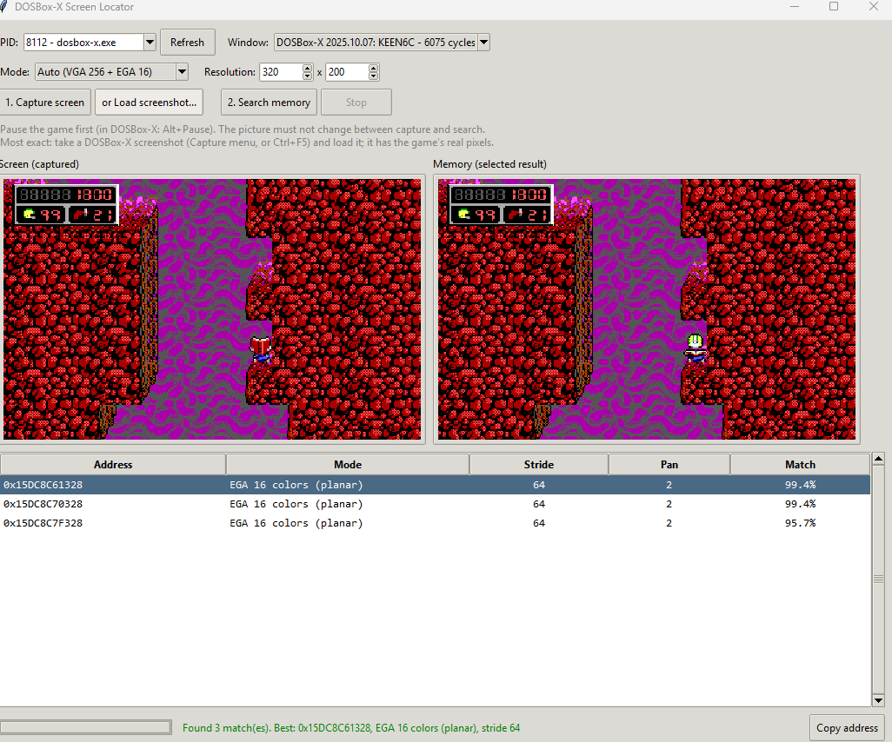
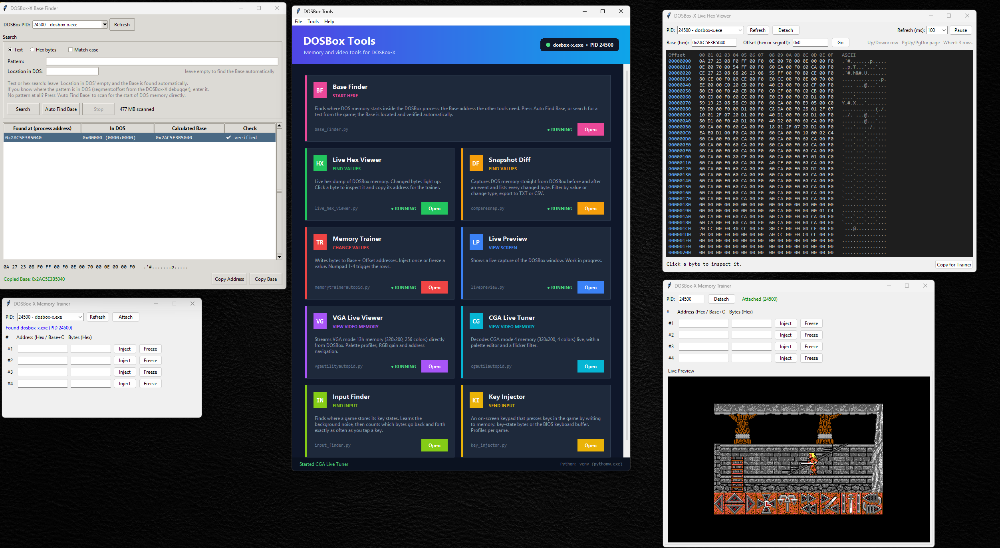
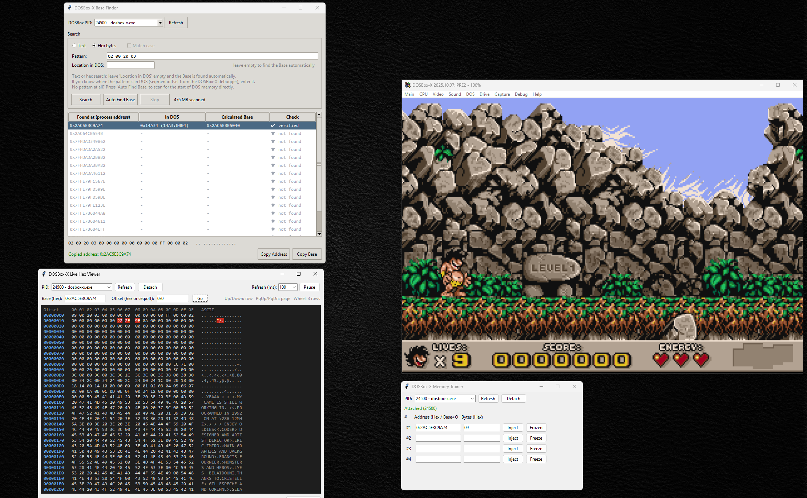
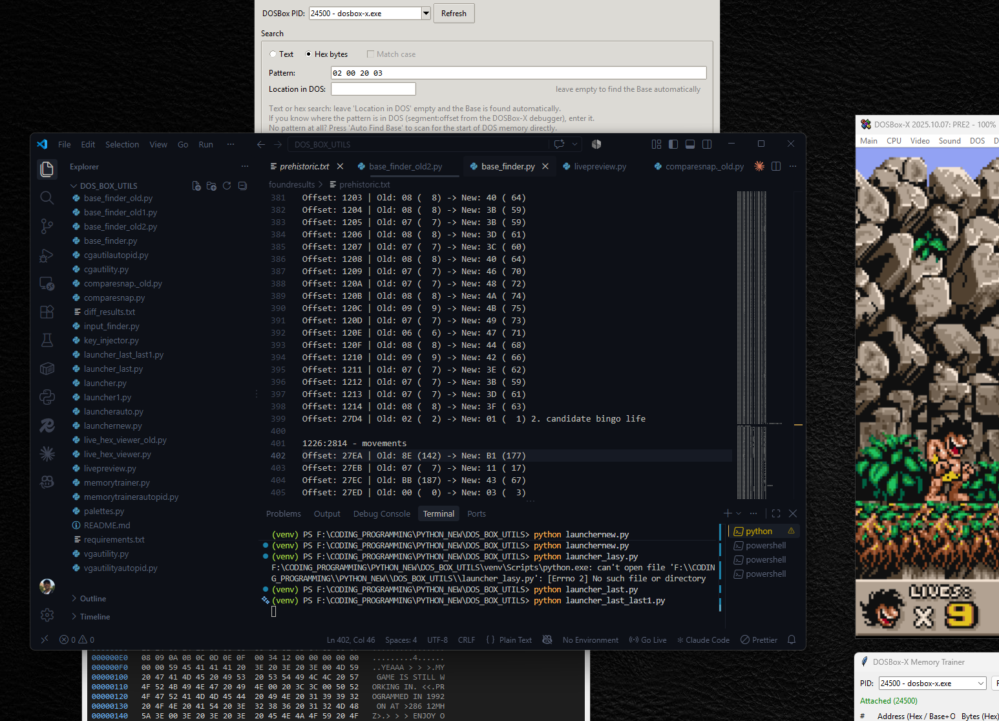
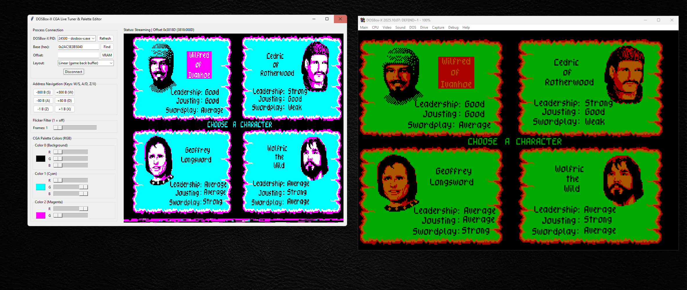

# DOSBox Tools

A set of small Python tools for reading and changing the memory of a running **DOSBox-X** game, with a launcher that ties them together.

> **Work in progress.** These tools were started as groundwork for letting an AI play DOS games: to play, an AI needs to _see_ the game (screen and video memory) and _understand its state_ (lives, score, position in memory). The current tools do this by hand; automating it is the next step.

---

## Installation

### Requirements

- Windows 10 or 11
- [Python 3.12 or newer](https://www.python.org/downloads/) (keep the default installer options; _tcl/tk_ must be included)
- [DOSBox-X](https://dosbox-x.com/)

### Steps

Open PowerShell or Command Prompt and run:

```bash
# 1. Get the code
git clone https://github.com/<your-username>/DOS_BOX_UTILS.git
cd DOS_BOX_UTILS

# 2. Create and activate a virtual environment
python -m venv venv
venv\Scripts\activate

# 3. Install the dependencies
pip install -r requirements.txt

# 4. Start the launcher
python launcher_last_last1.py
```

it is final (so far :D) launcher
Next time, only steps 2 (activate) and 4 are needed.

> If PowerShell refuses to run `activate`, allow local scripts once:
> `Set-ExecutionPolicy -Scope CurrentUser RemoteSigned`

---

## The tools

Start DOSBox-X with a game, then open a tool from the launcher. Every tool finds the DOSBox process (PID) automatically.

| Tool                | File                      | What it does                                                                                                                                                             |
| ------------------- | ------------------------- | ------------------------------------------------------------------------------------------------------------------------------------------------------------------------ |
| **Base Finder**     | `base_finder.py`          | Finds the Base address of DOS memory inside the DOSBox process and verifies it. Start here.                                                                              |
| **Live Hex Viewer** | `live_hex_viewer.py`      | Live hex dump of DOSBox memory. Changed bytes light up. Click a byte to see its value and copy its address.                                                              |
| **Snapshot Diff**   | `comparesnap.py`          | Captures DOS memory straight from DOSBox (or loads .bin dumps), compares two snapshots and lists every changed byte. Filters, debugger-style DS view and TXT/CSV export. |
| **Memory Trainer**  | `memorytrainerautopid.py` | Writes bytes to an address once, or freezes them at a value.                                                                                                             |
| **VGA Live Viewer** | `vgautilityautopid.py`    | Shows VGA mode 13h video memory (320x200, 256 colors) live.                                                                                                              |
| **CGA Live Tuner**  | `cgautilautopid.py`       | Shows CGA mode 4 video memory (320x200, 4 colors) live, with a flicker filter.                                                                                           |
| **Input Finder**    | `input_finder.py`         | Finds where a game stores its key states by counting which bytes go back and forth as you tap a key.                                                                     |
| **Key Injector**    | `key_injector.py`         | On-screen keypad that presses keys in the game by writing to memory. Profiles per game.                                                                                  |
| **Live Preview**    | `livepreview.py`          | Live capture of the DOSBox window.                                                                                                                                       |
| **Launcher**        | `launcher.py`             | Starts all of the above.                                                                                                                                                 |

### Typical workflow

0. **Find the Base** with the _Base Finder_ (once per DOSBox session, see below).
1. **Find** a value: watch memory in the _Live Hex Viewer_, or press _Capture 1_ before and _Capture 2_ after an event (e.g. losing a life) in _Snapshot Diff_ and filter by old/new value.
   Find **keys** with the _Input Finder_.
2. **Change** it: click _Copy for Trainer_ in the hex viewer, paste the address into the _Memory Trainer_, and inject or freeze a new value.
3. **Look** at the screen as the game stores it: the _VGA_ and _CGA_ viewers decode video memory directly.

### Addresses

Addresses are written as `Base + Offset` in hex, for example `0x1F2A0000 + 0x1234`:

- **Base** is where DOS memory starts inside the DOSBox process. It changes every time DOSBox starts.
- **Offset** is the position inside DOS memory, the same address the DOSBox-X debugger shows.

### Finding the Base

Open the _Base Finder_ while a game is running. There are three ways, from easiest to most manual:

1. **Auto Find Base:** one click, no input. The tool scans the whole DOSBox process and finds the start of DOS memory directly. No search text, no debugger, no location needed.
2. **Text or byte search with an empty _Location in DOS_:** search for a text the game shows (for example `barbarian`) or bytes copied from the DOSBox-X debugger. For each hit, the tool walks backwards until it finds the start of DOS memory. The results table then shows:
   - **Calculated Base:** the real Base.
   - **In DOS:** where the hit sits inside DOS memory, as `segment:offset` when it is below 1 MB. This is the same address the DOSBox-X debugger shows.
3. **Search with a known location:** if you already know the `segment:offset` of the pattern (e.g. `0823:0010`), enter it as _Location in DOS_ and the Base is calculated directly. This is the fallback if the automatic methods do not work.

Verified results get a green tick. Double-click one to copy the Base.

Once the Base is known, the video memory is always at `Base + 0xA0000` (VGA) or `Base + 0xB8000` (CGA), and offsets in the hex viewer match the DOSBox-X debugger.

#### How the start of DOS memory is recognised

The start of DOS memory always looks the same, which gives it a fingerprint:

- **Interrupt vector table** at `0000:0000`: 256 entries. Many of them (about 100 in DOSBox-X) point into the BIOS ROM segment `F000`. Unused entries may be empty, so only ROM segments (`C000` and above) are counted.
- **BIOS data area** right after it (`0040:0000`), with values every PC BIOS sets the same way: 640 KB of conventional memory at `0040:0013`, the keyboard buffer at `001E`-`003E`, and the video controller port (`3D4` or `3B4`).

All of these together are practically impossible to match by chance, so random data, internal DOSBox tables and leftover copies are rejected.

#### Testing and limitations

- The detection was tested on a simulated 16 MB DOSBox memory block placed at an unaligned address across read-chunk borders, with one search hit below 1 MB and a copy above 1 MB (extended memory), next to decoy regions containing thousands of fake "640" values and a zero-filled fake BIOS area. _Auto Find Base_ returned exactly the correct Base, both hits were linked to it, and none of the decoys passed.
- The fingerprint was then checked against the interrupt vector table and BIOS data area captured from a real DOSBox-X session. Two corrections came out of that: DOSBox-X leaves unused vectors empty (the first version expected them to share one segment), and the looser check that followed matched 150+ internal DOSBox tables. Adding the fixed BIOS data area values brought it back to exactly one result.
- If _Auto Find Base_ reports _No DOS memory found_ on your setup, use method 3 (known location) and please open an issue.

### Finding key input

Action games usually hook the keyboard interrupt and keep their own table of key states: a byte
changes when a key goes down and returns to its old value when the key is released. The
_Input Finder_ uses exactly that:

1. Stand still in the game and press **Learn noise**. For 3 seconds every byte that changes on its own
   (timers, music, animations) is recorded and ignored from then on.
2. Press **Start watching**, switch to the game and tap one key exactly as many times as _I tapped_ says.
3. Bytes that left their idle value and came back exactly that many times are marked with a star.
   The player position or score also change, but they do not return to the idle value, so they get 0 presses.

Simpler games read keys through the BIOS instead: the keyboard buffer at `0040:001E` and the shift flags
at `0040:0017` light up in the _Live Hex Viewer_.

### Sending key presses

The _Key Injector_ is a keypad with 10 configurable keys. Hold a button (or the number keys 1-0) to keep a key
pressed; release it to let go. Each key works in one of two modes:

- **Memory:** for games with their own key-state table. While held, the _Pressed_ bytes are written to the
  address again and again; on release, the _Idle_ bytes are written back. _Read_ fills _Idle_ with the
  current value.
- **BIOS key:** for games that read keys through the BIOS. The key is pushed into the BIOS keyboard buffer
  (`0040:001E`-`003D`) and the buffer's tail pointer is advanced, exactly as the BIOS does when a key is
  typed. Held keys repeat. _Barbarian_, which is played with the F-keys, works this way: F8 is scan code `42`.

Key settings can be saved as a profile per game in `profiles/`.

---

## Project structure

```
DOS_BOX_UTILS/
├── launcher.py                 Launcher
├── base_finder.py              Base Finder
├── live_hex_viewer.py          Live Hex Viewer
├── comparesnap.py              Snapshot Diff
├── memorytrainerautopid.py     Memory Trainer
├── vgautilityautopid.py        VGA Live Viewer
├── cgautilautopid.py           CGA Live Tuner
├── input_finder.py             Input Finder
├── key_injector.py             Key Injector
├── profiles/                   Key Injector profiles (one JSON per game)
├── livepreview.py              Live Preview
├── palettes.py                 VGA palettes (used by the VGA viewer)
├── foundresults/               Saved findings
├── logs/                       Error output of each tool (created by the launcher)
└── requirements.txt
```
### Finding the screen in memory

Some games do not draw straight to the usual video address: they scroll with hardware tricks,
flip between several screen pages, or use a virtual screen wider than the visible one.
The *Screen Locator* finds the picture anyway:

1. Pause the game (DOSBox-X: Alt+Pause) and take a screenshot (Ctrl+F5), or capture the window.
2. Load the screenshot and press **Search memory**.
3. The tool picks detailed rows from the screenshot, uses the pattern of where neighbouring pixels
   change color as a fingerprint (independent of the palette), and scans the DOSBox process for it,
   decoded both as VGA 256-color and EGA 16-color planar memory.
4. Each hit is checked by finding the line stride from a second row and comparing the whole frame.

The result gives the address, mode, stride and pixel pan to enter in the VGA viewer.

**Example: Commander Keen 6.** EGA 16 colors with a 512-pixel virtual screen (stride 64),
the picture starting 2 pixels into the first byte (pan 2), and three screen pages 0xF000 apart
that the game flips between. All of this was found automatically from one screenshot.



## Notes

- Windows only: the tools use the Windows API to read and write another process's memory.
- Some antivirus software may warn about the trainer, because writing to another process's memory is what game trainers do.
- If a tool does not open from the launcher, its error is in `logs/<tool>.log`.

## Roadmap

The goal is an AI that can play DOS games. It needs to **see** the game and **act** in it:

- Share the found Base with the other tools so it does not have to be pasted
- Read game state (lives, score, position) as structured data
- Switch the emulated screen mode from code
- Script sequences of key presses (macros) that an AI agent can trigger
- Connect the tools to an AI agent that can watch and play

## SCREEN SHOTS

**Launcher with the tools around it**


**Second Part **


**Finding the lives in Prehistoric2**


**Life Detection**


**CGA tool**

